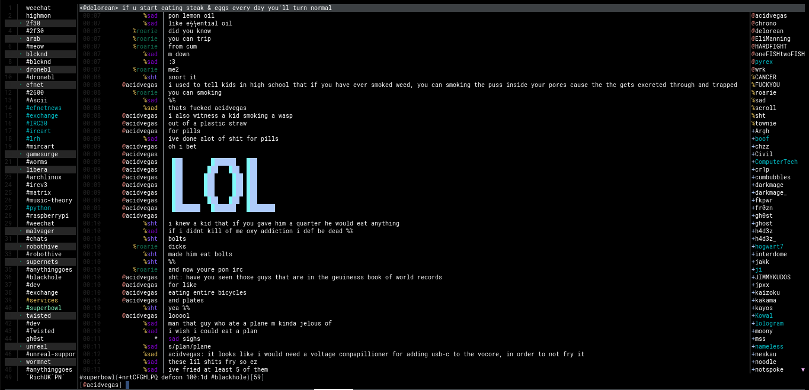

# WeeChat
> backup of me weechat setup



## Table of Contents
- [Setup](#setup)
  - [WeeChat](#weechat)
  - [Relay](#relay)
  - [Docker](#docker)
- [Settings](#settings)
  - [Appearance](#appearance)
  - [Settings](#appearance)
  - [IRC](#appearance)
  - [CTCP](#appearance)
  - [Scripts](#appearance)
- [Aliases](#aliases)
- [Triggers](#triggers)
- [Filters](#filters)
- [Servers](#servers)
- [Services](#services)
- [Proxy](#proxy)
- [Relay](#relay)
- [Keys](#keys)
- [Todo](#todo)

---

### Setup
###### Repository for Debian (because Debian is always 7 versions behind to deem themself "stable")
```shell
sudo mkdir /root/.gnupg
sudo chmod 700 /root/.gnupg
sudo mkdir -p /usr/share/keyrings
sudo gpg --no-default-keyring --keyring /usr/share/keyrings/weechat-archive-keyring.gpg --keyserver hkps://keys.openpgp.org --recv-keys 11E9DE8848F2B65222AA75B8D1820DB22A11534E
echo "deb [signed-by=/usr/share/keyrings/weechat-archive-keyring.gpg] https://weechat.org/debian bullseye main" | sudo tee /etc/apt/sources.list.d/weechat.list
sudo apt-get update
sudo apt-get install weechat-curses weechat-plugins weechat-python weechat-perl
```

###### WeeChat
```shell
git clone https://github.com/tat3r/tdfiglet.git && cd tdfiglet && make && sudo make install && cd
weechat -P "alias,buflist,charset,exec,fifo,fset,irc,logger,perl,python,relay,script,trigger,typing" -r "/set weechat.plugin.autoload alias,buflist,charset,exec,fifo,fset,irc,logger,perl,python,relay,script,trigger,typing;/save;/quit"
rm $HOME/.weechat/weechat.log && chmod 700 $HOME/.weechat && mkdir $HOME/.weechat/tls
git clone --depth 1 https://github.com/acidvegas/weechat.git $HOME/weechat
mv $HOME/weechat/alias.conf $HOME/.weechat/alias.conf && mv $HOME/weechat/scripts/perl/*.pl $HOME/.weechat/perl/autoload/ && mv $HOME/weechat/scripts/python/*.py $HOME/.weechat/python/autoload/
mkdir $HOME/.weechat/logs
mkfifo $HOME/.weechat/weechat_fifo
openssl req -x509 -new -newkey rsa:4096 -sha256 -days 3650 -out $HOME/.weechat/tls/cert.pem -keyout $HOME/.weechat/tls/cert.pem
chmod 400 $HOME/.weechat/tls/cert.pem
```

###### Relay
```shell
certbot certonly --standalone -d chat.acid.vegas -m acid.vegas@acid.vegas
echo -e "[Unit]\nDescription=cerbot renewal\n\n[Service]\nType=oneshot\nExecStart=/usr/bin/certbot renew -n --quiet --agree-tos --deploy-hook /home/acidvegas/.local/share/weechat/renew" > /etc/systemd/system/certbot.service
echo -e "[Unit]\nDescription=cerbot renewal timer\n\n[Timer]\nOnCalendar=0/12:00:00\nRandomizedDelaySec=1h\nPersistent=true\n\n[Install]\nWantedBy=timers.target" > /etc/systemd/system/certbot.timer
systemctl enable certbot.timer && systemctl start certbot.timer

echo "#!/bin/bash" > $HOME/.local/share/weechat/renew
echo "cat /etc/letsencrypt/live/chat.acid.vegas/fullchain.pem /etc/letsencrypt/live/chat.acid.vegas/privkey.pem > $HOME/.config/weechat/tls/relay.pem" >> $HOME/.local/share/weechat/renew
echo "chown -R acidvegas:acidvegas $HOME/.weechat/tls/relay.pem && chmod 400 $HOME/.confg/weechat/tls/relay.pem" >> $HOME/.local/share/weechat/renew
echo "printf \'%b\' \'*/relay tlscertkey\n\' > /run/user/1000/weechat/weechat_fifo" >> $HOME/.local/share/weechat/renew
chmod +x $HOME/.local/share/weechat/renew

mkdir -p $HOME/.config/systemd/user
echo -e "[Unit]\nDescription=headless weechat relay service\nAfter=network.target\n\n[Service]\nType=forking\nExecStart=/usr/bin/weechat-headless --daemon\n\n[Install]\nWantedBy=default.target" > $HOME/.config/systemd/user/weechat-headless.service
systemctl --user enable weechat-headless
```

---

### Settings
###### Appearance
```
/set buflist.format.buffer              "${if:${type}==server?${if:${window[gui_current_window].buffer.local_variables.server}==${buffer.local_variables.server}?${color:235,235}${format_number}${if:${irc_server.is_connected}?${color:green,235}:${color:lightred,235}}• ${color:default,235}${name}:${color:235,235}${format_number}${if:${irc_server.is_connected}?${color:green,235}:${color:lightred,235}}• ${color:default,235}${indent}${name}}:}${if:${type}=~(channel|private)?${format_number}${color_hotlist}${indent}${name}:}${if:${type}!~(channel|private|server)?${format_number}${color:gray}  ${name}:}"
/set buflist.format.buffer_current      "${if:${type}==server?${if:${window[gui_current_window].buffer.local_variables.server}==${buffer.local_variables.server}?${color:lightred}${if:${irc_server.is_connected}?${color:235,235}${format_number}${color:green,235}:${color:lightred,235}}• ${name}${format_hotlist}:${color:237}${if:${irc_server.is_connected}?${color:235,235}${format_number}${color:green,235}:${color:lightred,235}}• ${name}}${format_lag}${format_hotlist}:${if:${type}=~(channel|private)?${format_number}• ${color:lightgreen}${name}:${if:${type}!~(channel|private|server)?${format_number}${color:lightgreen}  ${name}:}}}"
/set buflist.format.hotlist_highlight   "${color:yellow}"
/set buflist.format.hotlist_message     "${color:cyan}"
/set buflist.format.hotlist_private     "${color:yellow}"
/set buflist.format.number              "${color:235}${number}${if:${number_displayed}? │: }"
/set irc.color.input_nick               default
/set irc.color.nick_prefixes            "y:green;q:green;a:lightred;o:red;h:yellow;v:lightblue;*:lightmagenta"
/set irc.color.reason_quit              darkgray
/set irc.color.topic_new                lightblue
/set irc.look.display_join_message      ""
/set irc.look.display_old_topic         off
/set irc.look.item_nick_modes           off
/set irc.look.server_buffer             independent
/set weechat.bar.buflist.size_max       20
/set weechat.bar.fset.separator         off
/set weechat.bar.input.color_delim      darkgray
/set weechat.bar.input.conditions       "${window.buffer.full_name} != highmon"
/set weechat.bar.input.items            "[input_prompt]+(away),[input_search],[input_paste],input_text"
/set weechat.bar.input.separator        off
/set weechat.bar.nicklist.size_max      15
/set weechat.bar.status.color_bg        default
/set weechat.bar.status.color_delim     darkgray
/set weechat.bar.status.conditions      "${window.buffer.full_name} != highmon"
/set weechat.bar.status.items           "buffer_name+(buffer_modes)+[buffer_nicklist_count]"
/set weechat.bar.status.separator       off
/set weechat.bar.title.color_bg         black
/set weechat.bar.title.separator        off
/set weechat.bar.title.size_max         2
/set weechat.color.chat_delimiters      darkgray
/set weechat.color.chat_highlight_bg    default
/set weechat.color.chat_host            darkgray
/set weechat.color.chat_nick            white
/set weechat.color.chat_nick_colors     "cyan,magenta,green,brown,lightblue,default,lightcyan,lightmagenta,lightgreen,blue,31,35,38,40,49,63,70,80,92,99,112,126,130,138,142,148,160,162,167,169,174,176,178,184,186,210,212,215,247"
/set weechat.color.chat_prefix_error    lightred
/set weechat.color.chat_prefix_network  lightblue
/set weechat.color.chat_prefix_suffix   darkgray
/set weechat.color.chat_read_marker     darkgray
/set weechat.color.chat_time            235
/set weechat.color.chat_time_delimiters 235
/set weechat.color.separator            darkgray
/set weechat.look.bar_more_down         "▼"
/set weechat.look.bar_more_left         "◀"
/set weechat.look.bar_more_right        "▶"
/set weechat.look.bar_more_up           "▲"
/set weechat.look.buffer_time_format    " %H:%M"
/set weechat.look.chat_space_right      on
/set weechat.look.day_change            off
/set weechat.look.item_buffer_filter    "•"
/set weechat.look.prefix_align_max      15
/set weechat.look.prefix_join           "▬▬▶"
/set weechat.look.prefix_quit           "◀▬▬"
/set weechat.look.prefix_suffix         "│"
/set weechat.look.quote_time_format     "%H:%M"
/set weechat.look.read_marker_string    "─"
/set weechat.look.separator_horizontal  "─"
/set weechat.look.separator_vertical    "│"
/set weechat.look.window_title          "hardchats"
/set weechat.startup.display_logo       off
/set weechat.startup.display_version    off
```

###### Settings
```
/set buflist.look.mouse_wheel               off
/set buflist.look.mouse                     off
/set irc.look.buffer_switch_autojoin        off
/set irc.look.buffer_switch_join            on
/set irc.look.join_auto_add_chantype        on
/set irc.look.smart_filter                  off
/set irc.look.temporary_servers             on
/set irc.look.typing_status_nicks           on
/set irc.network.ban_mask_default           "*!*@$host"
/set sec.crypt.hash_algo                    sha512
/set typing.look.enabled_nicks              on
/set weechat.look.confirm_quit              on
/set weechat.look.highlight                 "acidvegas,supernets,super nets"
/set weechat.look.mouse                     on
/set weechat.plugin.autoload                "alias,buflist,charset,exec,fifo,fset,irc,logger,perl,python,relay,script,trigger"
/set logger.file.color_lines                on
/set logger.file.auto_log                   off
/set logger.look.backlog                    0
/set logger.file.rotation_compression_type  gzip
/set logger.file.rotation_compression_level 80
/set logger.file.rotation_size_max          "1g"
/set logger.file.time_format                "%Y-%m-%d %H:%M"
/set logger.level.irc                       0
/set logger.level.core.weechat              0
/set logger.mask.irc                        "$server/$channel.log"

```

###### IRC
```
/set irc.server_default.anti_flood_prio_high 0
/set irc.server_default.anti_flood_prio_low  0 
/set irc.server_default.autorejoin           on
/set irc.server_default.autorejoin_delay     3
/set irc.server_default.command_delay        3
/set irc.server_default.msg_part             "G-line: User has been permanently banned from this network."
/set irc.server_default.msg_quit             "G-line: User has been permanently banned from this network."
/set irc.server_default.nicks                "acidvegas,acid_vegas,acid.vegas,acidvegas_"
/set irc.server_default.realname             "04MOST DANGEROUS MOTHERFUCK‮"
/set irc.server_default.sasl_fail            continue
/set irc.server_default.sasl_mechanism       external
/set irc.server_default.sasl_username        "acidvegas"
/set irc.server_default.tls_cert             "%h/tls/cert.pem"
/set irc.server_default.tls_password         "REDACTED"
/set irc.server_default.tls_verify           off
/set irc.server_default.username             "stillfree"
```

###### CTCP
```
/set irc.ctcp.clientinfo           ""
/set irc.ctcp.finger               ""
/set irc.ctcp.ping                 ""
/set irc.ctcp.source               ""
/set irc.ctcp.time                 ""
/set irc.ctcp.userinfo             ""
/set irc.ctcp.version              ""
/set irc.look.ctcp_time_format     ""
/set irc.look.display_ctcp_blocked off
/set irc.look.display_ctcp_reply   off
/set irc.look.display_ctcp_unknown off
```

###### Scripts
```
/set plugins.var.perl.antifuck.autopart           1
/set plugins.var.perl.antifuck.nobufs             1
/set plugins.var.perl.fuckyou.forcejoin           SAJOIN
/set plugins.var.perl.fuckyou.forcepart           SAPART
/set plugins.var.perl.fuckyou.furry               &ENTERTHEVOID
/set plugins.var.perl.fuckyou.parallel            25
/set plugins.var.perl.keepnick.default_enable     1
```

---

### Aliases

See [alias.conf](https://github.com/acidvegas/weechat/blob/master/alias.conf) file.

---

### Triggers
```
/trigger del beep
/trigger add hate                modifier irc_out1_PRIVMSG             "" "/hate/04 HATE "
/trigger add input_command_color modifier "500|input_text_display"     "${tg_string} =~ ^/($|[^/])" "#/(.+)#${color:39}/${color:74}${re:1}#"
/trigger add numberjump          modifier "2000|input_text_for_buffer" "${tg_string} =~ ^/[0-9]+$" "=\/([0-9]+)=/buffer *${re:1}=" "" "" "none"
/trigger add url_color           modifier "weechat_print"              "${tg_tags} !~ irc_quit" ";[a-z]+://\S+;${color:32}${color:underline}${re:0}${color:-underline}${color:reset};" ""
/trigger add relay_away_off      signal   relay_client_connected       "" "" "/away -all"
/trigger add relay_away_on       signal   relay_client_disconnected    "${info:relay_client_count,connected} == 0" "" "/away -all I am away"
```

- Highlight monitor *(This can cmpletely replace [highmon.pl](https://weechat.org/scripts/source/highmon.pl.html/))*
```
/trigger add highmon_like print "*;irc_privmsg"
/trigger set highmon_like conditions "${tg_highlight} == 1 && ${tg_displayed} == 1 && ${buffer.local_variables.type} == channel"
/trigger set highmon_like command "/print -newbuffer highmon -tags ${tg_tags} ${color:${info:nick_color_name,${server}}}${color:${weechat.color.chat_prefix_more}}${weechat.look.prefix_buffer_align_more}${color:${info:nick_color_name,${channel}}}${channel}\t${if:${tg_tags} !~ ,irc_action,?${weechat.look.quote_nick_prefix}${tg_prefix}${color:reset}${weechat.look.quote_nick_suffix}:${tg_prefix}${color:reset}} ${tg_message}"
```

---

### Filters

**NOTE:** All filters can be toggled on/off with the `ALT + =` keyboard shortcut.

- Hide everything that is not a channel message *(useful for reading backlog)*:

`/filter add crap * irc_join,irc_part,irc_quit,irc_mode,irc_topic,irc_nick,irc_account,irc_quit *`

---

### Servers
```
/server add 2f30      irc.2f30.org/6697              -tls
/server add anope     irc.anope.org/6697             -tls
/server add blackcatz irc.blackcatz.org/6697         -tls
/server add blcknd    irc.blcknd.net/6697            -tls
/server add buttes    irc.buttes.org/6697            -tls
/server add efnet     irc.servercentral.net/9999     -tls
/server add libera    irc.libera.chat/6697           -tls
/server add gamesurge irc.gamesurge.net
/server add gangnet   irc.gangnet.ru                 -tls
/server add hackint   irc.hackint.org/6697           -tls
/server add irc       irc.internetrelaychat.net/6697 -tls
/server add ircstorm  irc.ircstorm.net/6699          -tls
/server add malvager  irc.malvager.net/6697          -tls
/server add oftc      irc.oftc.net/6697              -tls
/server add sandnet   irc.sandngz.net/6697           -tls
/server add silph     irc.silph.co/6697              -tls
/server add supernets irc.supernets.org/6697         -tls
/server add tcpdirect ircd.chat/6697                 -tls
/server add terahertz irc.terahertz.net/6697         -tls
/server add unreal    irc.unrealircd.org/6697        -tls
/server add wigle     wigle.net                      -tls
/server add wormnet   wormnet1.team17.com
/server add wtfux     irc.wtfux.org/6697             -tls

/set irc.server.2f30.autojoin        #2f30
/set weechat.notify.irc.22f30        highlight
/set irc.server.anope.autojoin       #anope
/set irc.serber.blackcatz            #blackcatz
/set irc.server.blcknd.autojoin      #blcknd,#chat
/set irc.server.buttes.autojoin      #gamme
/set irc.server.efnet.autojoin       #2600,#efnetnews,#exchange,#irc30,#lrh
/set irc.server.gamesurge.autojoin   #nfo-support,#worms
/set weechat.notify.irc.gamesurge    highlight
/set irc.server.irc.autojoin         #h4x
/set irc.server.ircstorm.autojoin    #schizophrenia
/set irc.server.libera.autojoin      #archlinux,#ircv3,#matrix,#music-theory,#python,#raspberrypi,#weechat
/set weechat.notify.irc.libera       message
/set irc.server.malvager.autojoin    #malvager
/set irc.server.sandnet.autojoin     #arab
/set irc.server.sandnet.away_check   60
/set irc.server.silph.autojoin       #ramen
/set irc.server.supernets.away_check 60
/set irc.server.tcpdirect.autojoin   #tcpdirect
/set irc.server.terahertz.autojoin   #ix
/set irc.server.unreal.autojoin      #unreal-support,#superbowl,#syzop-smells
/set irc.server.unreal.command       /MODE acidvegas -x
/set irc.server.wigle.autojoin       #wigle
/set irc.server.wormnet.autojoin     #anythinggoes
/set irc.server.wormnet.password     ELSILRACLIHP
/set irc.server.wormnet.realname     "48 0 US 3.7.2.1"
/set weechat.notify.irc.wormnet      highlight
/set irc.server.wtfux.autojoin       #ED,#wtfux

```

---

### Services
```
/secure passphrase  PASSWORD
/secure set NETWORK PASSWORD
/set irc.server.networkname.command "/msg NickServ IDENTIFY ${sec.data.networkname}

/msg NickServ register PASSWORD EMAIL
/msg NickServ ACCESS DEL CHANGEME
/msg NickServ ACCESS ADD *@big.dick.acid.vegas
/msg NickServ AJOIN ADD <channel>
/msg NickServ CERT ADD
/msg NickServ SET AUTOOP ON
/msg NickServ SET HIDE EMAIL ON
/msg NickServ SET HIDE STATUS ON
/msg NickServ SET HIDE USERMASK ON
/msg NickServ SET HIDE QUIT ON
/msg NickServ SET KEEPMODES ON
/msg NickServ SET KILL QUICK
/msg NickServ SET PRIVATE ON
/msg NickServ SET SECURE ON
/msg HostServ REQUEST MOST.DANGEROUS.MOTHER.FUCK
/msg HostServ ON

```

---

### Proxy
```
/proxy add tor socks5 127.0.0.1 9050
/set irc.server.CHANGEME.proxy tor
```

---

### Relay
```
/secure set relay PASSWORD
/secure set totp SECRET
/set relay.network.max_clients 2
/set relay.network.password ${sec.data.relay}
/set relay.network.totp_secret ${sec.data.totp}
/relay tlscertkey
/relay add tls.weechat PORT
```

---

### Keys
| Keys      | Description                           | Command                             |
| --------- | ------------------------------------- | ----------------------------------- |
| `ALT + n` | Scroll to next highlight              | `/window scroll_next_highlight`     |
| `ALT + p` | Scroll to previous highlight          | `/window scroll_previous_highlight` |
| `ALT + u` | Scroll to first unread line in buffer | `/window scroll_unread`             |

| Keys          | Description              | Command                       |
| ------------- | ------------------------ | ----------------------------- |
| `Left`        | Move cursor to the left  | `/input move_previous_char`   |
| `Right`       | Move cursor to the right | `/input move_next_char`       |
| `Backspace`   | Delete character         | `/input delete_previous_char` |
| `Enter`       | Send                     | `/input return`               |
| `ALT + Enter` | Insert new line          | `/input insert \n`            |

| Keys               | Description         | Command                   |
| ------------------ | ------------------- | ------------------------- |
| `CTRL + r`         | Search text         | `/input search_text_here` |
| `CTRL + y`         | Paste               | `/input clipboard_paste`  |
| `CTRL + l`         | Refresh window      | `/window refresh`         |
| `ALT  + l`         | Toggle bare display | `/window bare`            |
| `Alt  + Shift + b` | Toggle buffer list  | `/bar toggle buflist`     |
| `Alt  + Shift + n` | Toggle nicklist     | `/bar toggle buflist`     |

| Keys          | Description         | Command                    |
| ------------- | ------------------- | -------------------------- |
| `Tab`         | Complete next       | `/input complete_next`     |
| `Shift + Tab` | Complete previous   | `/input complete_previous` |

| Keys          | Description                        | Command                          |
| ------------- | ---------------------------------- | -------------------------------- |
| `Up`          | Show previous input history        | `/input history_previous`        |
| `Down`        | Show next input history            | `/input history_next`            |
| `CTRL + Up`   | Show previous global input history | `/input history_global_previous` |
| `CTRL + Down` | Show next global input history     | `/input history_global_next`     |

| Keys         | Description           | Command      |
| ------------ | --------------------- | ------------ |
| `ALT + #`    | Go to Nth buffer      | `/buffer *N` |
| `ALT + Up`   | Go to previous buffer | `/buffer -1` |
| `ALT + Down` | Go to next buffer     | `/buffer +1` |

| Keys         | Description                               | Command                 |
| ------------ | ----------------------------------------- | ----------------------- |
| `PgUp`       | Scroll up one page in buffer history      | `/window page_up`       |
| `PgDn`       | Scroll down one page in buffer history    | `/window page_down`     |
| `ALT + PgUp` | Scroll up a few lines in buffer history   | `/window scroll_up`     |
| `ALT + PgDn` | Scroll down a few lines in buffer history | `/window scroll_down`   |
| `ALT + Home` | Scroll to top of buffer                   | `/window scroll_top`    |
| `ALT + End`  | Scroll to bottom of buffer                | `/window scroll_bottom` |

| Keys           | Description                     | Command              |
| -------------- | ------------------------------- | -------------------- |
| `Ctrl + c, b`  | Insert code for bold text       | `/input insert \x02` |
| `Ctrl + c, c`  | Insert code for colored text    | `/input insert \x03` |
| `Ctrl + c, i`  | Insert code for italic text     | `/input insert \x1D` |
| `Ctrl + c, o`  | Insert code for color reset     | `/input insert \x0F` |
| `Ctrl + c, v`  | Insert code for reverse color   | `/input insert \x16` |
| `Ctrl + c, _`  | Insert code for underlined text | `/input insert \x1F` |

___

###### Mirrors
[acid.vegas](https://git.acid.vegas/weechat) • [GitHub](https://github.com/acidvegas/weechat) • [GitLab](https://gitlab.com/acidvegas/weechat) • [SuperNETs](https://git.supernets.org/acidvegas/weechat)
